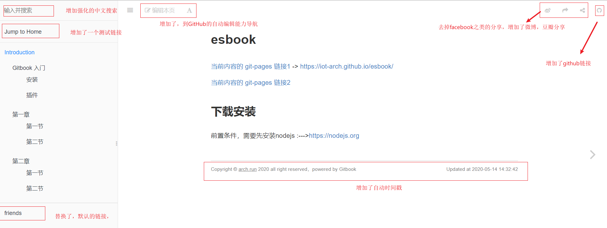

# esbook

[当前内容的 git-pages 链接](https://iot-arch.github.io/esbook/) -> https://iot-arch.github.io/esbook/


## 目录

[快捷目录页](SUMMARY.md)


## 使用gitbook

前置条件，需要先安装nodejs :--->https://nodejs.org

``` bash

Help CMD list for make
make          - Build the book
make build    - Build the book
make serve    - Serving the book on localhost:4000
make install  - Install gitbook and plugins
make epub     - Build epub book
make pdf      - Build pdf book
make mobi     - Build mobi book
make clean    - Remove generated files

```


## 脚本工具

[工具脚本](publish_to_gh.sh)


## demo 说明


